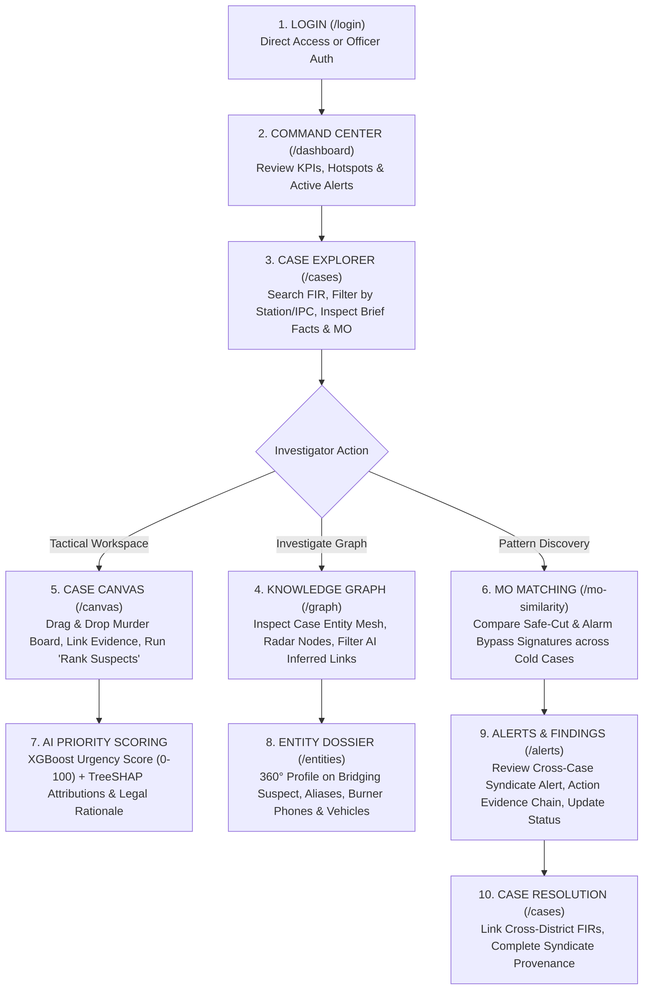

# 🏛️ NETRA (VAJRA-X21) — Application Flow & Presenter Master Reference

> **Document Type:** Institutional Application Flow, Code Audit & Live Presentation Guide  
> **System Name:** NETRA (National Evidence Tracking & Relational Analytics) / **VAJRA-X21**  
> **Jurisdiction / Domain:** Criminal Intelligence Unit (CIU), Mumbai Police  
> **Source Baseline:** Verified codebase (September 2026)  
> **Rule:** Strictly code-grounded. No unverified claims, imaginary routes, or phantom features.

---

## 📑 Table of Contents
1. [Current App Structure](#1-current-app-structure)
2. [Complete Tab / Page Tree](#2-complete-tab--page-tree)
3. [Tab-by-Tab Breakdown](#3-tab-by-tab-breakdown)
4. [Actual Investigator User Flow](#4-actual-investigator-user-flow)
5. [Best Live Demo Flow](#5-best-live-demo-flow)
6. [Feature Coverage Matrix](#6-feature-coverage-matrix)
7. [Technical Feature Mapping](#7-technical-feature-mapping)
8. [3-Minute Story Structure](#8-3-minute-story-structure)
9. [1–1.5 Minute Technical Story Structure](#9-115-minute-technical-story-structure)
10. [Script Reference Sheet (Cue Cards)](#10-script-reference-sheet-cue-cards)
11. [Implemented vs Partial vs Mocked Features](#11-implemented-vs-partial-vs-mocked-features)
12. [Important Gaps & Things Not Safe to Claim](#12-important-gaps--things-not-safe-to-claim)

---

## 1. CURRENT APP STRUCTURE

NETRA (VAJRA-X21) is a single-page React 19 web application bundled with Vite, styled with Tailwind CSS, connecting to a Python FastAPI machine learning microservice and a Supabase PostgreSQL database (with an automatic offline local dataset fallback).

- **Application Name:** NETRA (VAJRA-X21) — Criminal Intelligence Unit, Mumbai Police
- **Authentication Gateway:** Protected Route layout checking `AuthContext` (redirects to `/login` if unauthenticated).
- **Default Landing Route:** `/dashboard` (Command Center).
- **Global Layout Structure (`AppShell.jsx`):**
  - **Top Institutional Header:** Collapsible sidebar toggle, NETRA emblem, Global Typeahead search bar across FIRs and Persons, Live CCTNS Sync indicator, Clearance Level badge, and Settings/Demo controller button.
  - **Left Collapsible Sidebar:** Split into *Operational Registry* and *Intelligence & Analysis*, Demo Mode quick-launcher card, and active Officer Profile footer.
  - **Persistent Floating Bottom Banner (`DemoModeBanner.jsx`):** Active only during Demo Mode, providing 9-step scripted storyline navigation.
  - **Global Modals:** `SettingsModal.jsx` (System Diagnostics & Demo Controller) and `FIRUploadModal.jsx` (OCR / PDF Ingestion).

---

## 2. COMPLETE TAB / PAGE TREE

```text
NETRA (VAJRA-X21)
│
├── [Auth Gateway]
│   └── /login (Officer Sign-In & Direct Access Bypass)
│
├── 📁 OPERATIONAL REGISTRY
│   ├── /dashboard (Command Center — Default Landing)
│   │   ├── Metric KPI Cards (Active Cases, High-Risk Flags, Syndicates)
│   │   ├── Interactive Crime Distribution & Trend Charts (Recharts)
│   │   ├── Geospatial Crime Activity Map (Leaflet / Hotspots)
│   │   ├── Recent Priority Alerts Feed
│   │   └── AI Findings Stream
│   │
│   ├── /cases (Case & FIR Search Explorer)
│   │   ├── Search & Multi-Faceted Filter Sidebar (Category, Status, Station)
│   │   ├── Registered Cases Master List
│   │   ├── Complete Case Investigation Dossier (Brief Facts, MO Breakdown, Accused)
│   │   ├── [Modal] "Upload New FIR Document" (FIRUploadModal)
│   │   └── [Action] Jump to Case Canvas (`/canvas?case_id=...`) or Knowledge Graph (`/graph?caseId=...`)
│   │
│   └── /entities (360° Entity Dossier)
│       ├── Searchable Persons & Accused List (Live Debounced Search)
│       ├── Accused / Suspect Identity & Status Header
│       ├── Tab 1: Chronological Activity Timeline
│       ├── Tab 2: Known Associates & Graph Network Links
│       ├── Tab 3: Registered Assets (Phones, Vehicles, Bank Accounts)
│       └── Tab 4: Historical Crime & FIR Involvements
│
├── 🧠 INTELLIGENCE & ANALYSIS
│   ├── /graph (Geospatial Knowledge Graph)
│   │   ├── Searchable Case Selector & Case Scope Filter
│   │   ├── Geospatial Leaflet Graph Map (Radar Pulse Nodes & Entity Markers)
│   │   ├── Provenance Filters (All / Confirmed Evidence / AI Inferred)
│   │   ├── Side Entity Inspection Panel (Full Dossier Peek & 1-Hop Connections)
│   │   └── [Action] "Center on Pin" & "Inspect Full Dossier"
│   │
│   ├── /canvas (Case Canvas — Digital Murder Board)
│   │   ├── Searchable Case Selector
│   │   ├── ReactFlow Interactive Canvas (PersonCards, NoteCards, EntityCards)
│   │   ├── Canvas Toolbar (Add Suspect, Add Note, Add Entity, Undo, Redo, Clear)
│   │   ├── [Modal] Edge Relationship Justification & Provenance Modal
│   │   ├── [Drawer] Case Notes & Lead Log Drawer
│   │   ├── [Modal] Canvas Snapshot Save/Restore Modal
│   │   └── [Action] "⚡ Run Suspect Priority Analysis" (XGBoost + SHAP Explainability Modal)
│   │
│   ├── /alerts (Alerts & Action Queue)
│   │   ├── Live Severity Counters (High, Medium, Low)
│   │   ├── Severity & Status Multi-Filter Bar
│   │   ├── Interactive Alert Cards (Expandable with Evidence Chains & Action Next-Steps)
│   │   ├── [Action] Mark Alert as "Investigating" or "Resolved"
│   │   └── AI Findings Live Intelligence Stream
│   │
│   └── /mo-similarity (Modus Operandi Pattern Matching)
│       ├── Reference Case Selector
│       ├── 10-Point Structured MO Fingerprint Attribute Matrix
│       ├── 2D Semantic Embedding Space Scatter Plot (Recharts)
│       └── Ranked Similar Cases Feed with Percentage Match & Component Explanations
│
└── ⚙️ GLOBAL CONTROLS & OVERLAYS
    ├── [Modal] SettingsModal (Demo Mode Toggle, Storyline Step Jumper, DB Health)
    └── [Persistent Banner] DemoModeBanner (9-Step Scripted Guided Demo Overlay)
```

---

## 3. TAB-BY-TAB BREAKDOWN

---

### 1. Command Center / Dashboard
- **Route:** `/dashboard`
- **Purpose:** Executive command overview of district-wide crime metrics, active alerts, jurisdiction hotspots, and priority triage feed.
- **What the investigator sees:**
  - 4 top-level metric cards: *Active Cases*, *Pending Alerts*, *High-Risk Suspects*, and *Tracked Entities*.
  - Crime category distribution bar chart & monthly case trend line chart.
  - Interactive Leaflet crime hotspot map centered on Mumbai police jurisdictions.
  - Live AI Findings feed (cross-case links, safe shear metallurgy matches, phone intercepts).
  - Recent Alerts ticker with direct navigation links.
- **Main buttons/actions:**
  - Hotspot card selection: Pans the map to that police station sector.
  - "View All Alerts" button -> navigates to `/alerts`.
  - "Explore Cases" button -> navigates to `/cases`.
- **Backend/API used:** `alertsService.getDashboardMetrics()`.
- **Database source:** Supabase PostgreSQL (`cases`, `persons`, `alerts`, `findings`) with automatic fallback to `localDB`.
- **Implementation Status:** **Fully Functional** (reads dynamically from Supabase or fallback; charts and map render reactive live data).

---

### 2. Case & FIR Search
- **Route:** `/cases` (supports URL query params: `?id=...`, `?q=...`, `?category=...`, `?station=...`)
- **Purpose:** Full-text lookup and multi-faceted search across all registered FIRs with an in-depth case dossier pane.
- **What the investigator sees:**
  - **Left Pane (5 columns):** Search bar, Category dropdown, Status dropdown, Police Station dropdown, and scrollable case cards with crime numbers, police stations, registration dates, and status badges.
  - **Right Pane (7 columns):** Full case dossier:
    - Primary identifiers (Crime No, Case No, Status, Acts & Sections).
    - Case intelligence summary cards (Accused Count, MO extraction confidence, Similar cases count, Evidence pieces count).
    - Official Brief Facts narrative.
    - Structured MO breakdown (Target profile, Entry method, Tools used, Transport, Escape route).
    - Linked Accused and Suspects cards with status tags and confidence bars.
    - Linked Evidence table (evidence type, description, chain of custody source).
- **Main buttons/actions:**
  - "Case Canvas" button -> navigates to `/canvas?case_id=[id]`.
  - "Knowledge Graph" button -> navigates to `/graph?caseId=[id]`.
  - "Upload New FIR Document" -> opens `FIRUploadModal`.
  - Accused card click -> navigates to `/entities?id=[person_id]`.
- **Backend/API used:** `casesService.getCases(filters)`, `casesService.getCaseById(id)`.
- **Database source:** Supabase `cases` table / `localDB.cases`.
- **Implementation Status:** **Fully Functional** (faceted filtering, URL deep-linking, and cross-navigation are fully wired).

---

### 3. Entity Profile (360° Dossier)
- **Route:** `/entities` (supports `?id=[person_id]`)
- **Purpose:** Deep-dive dossier on any suspect, accused, witness, or person of interest.
- **What the investigator sees:**
  - Searchable person selector with live debounced search and alias matching.
  - Dossier header: Full name, known aliases, primary status tag (`Accused`, `Key Suspect`, `Person of Interest`), confidence score, and gender/DOB.
  - 4 Dossier Tabs:
    1. **Timeline Tab:** Chronological sequence of sightings, call tower logs, and registered incidents.
    2. **Associates & Network Tab:** Cards of connected individuals with relationship labels, confidence scores, and evidence sources.
    3. **Registered Assets Tab:** Linked mobile phones (IMEI/SIM), registered vehicles, and flagged bank/mule accounts.
    4. **Case Involvements Tab:** Cards of all FIRs linking this individual with crime heads and status.
- **Main buttons/actions:**
  - Tab switcher (Timeline / Network / Assets / Cases).
  - Associate card click -> switches dossier to that associate.
  - Linked Case card click -> navigates to `/cases?id=[case_id]`.
  - "View in Knowledge Graph" button -> navigates to `/graph?case_id=...`.
- **Backend/API used:** `entitiesService.getPersons()`, `entitiesService.getPersonById()`, `graphService.getCaseIntelligenceNetwork()`.
- **Database source:** Supabase `persons`, `relationships`, `phones`, `vehicles`, `accounts` tables / `localDB`.
- **Implementation Status:** **Fully Functional**.

---

### 4. Knowledge Graph (Geospatial Network Explorer)
- **Route:** `/graph` (supports `?case_id=[id]`)
- **Purpose:** Interactive geospatial network graph plotting entities, assets, crime locations, and relationships on a dark tactical map.
- **What the investigator sees:**
  - Top case search selector (scopes the graph to a specific FIR or global network).
  - Leaflet map rendering customized pulsing radar markers:
    - `PER` (Person - Blue / Red glow for Accused)
    - `PH` (Phone - Sky Blue)
    - `VEH` (Vehicle - Emerald Green)
    - `ACC` (Account - Purple)
    - `FIR` (Case Anchor - Amber/Red)
    - `LOC` (Location - Teal)
  - Polylines connecting nodes (solid for verified observed links, dashed for AI-inferred links).
  - Right slideout Inspection Dossier Card when a node is clicked (shows metadata, 1-hop connections, and quick actions).
  - Slideout Filter Panel (filter by Minimum Confidence % and Provenance: *All* / *Confirmed* / *AI Clues*).
- **Main buttons/actions:**
  - Node click: Highlights node, draws connection lines, opens right inspection card.
  - "Center on Pin" button: Animates map flyTo directly to coordinates.
  - "Inspect Full Dossier" button: Navigates to `/entities?id=...` or `/cases?id=...`.
  - "⚡ Find Cross-Case Connections" button (Visible in Demo Mode): Triggers cross-case discovery step.
  - Fullscreen toggle button.
- **Backend/API used:** `graphService.getCaseIntelligenceNetwork(caseId, filters)`.
- **Database source:** Supabase `relationships`, `cases`, `persons`, `phones`, `vehicles` / `localDB`.
- **Implementation Status:** **Fully Functional** (force-coordinates, Leaflet markers, polyline edges, and filter controls are reactive).

---

### 5. Case Canvas (Digital Murder Board)
- **Route:** `/canvas` (supports `?case_id=[id]`)
- **Purpose:** Freeform investigative whiteboard where detectives drag, drop, connect entities, add notes, and trigger AI Suspect Priority Ranking.
- **What the investigator sees:**
  - Case selector bar.
  - ReactFlow interactive canvas with grid background, minimap, and zoom controls.
  - Custom Nodes:
    - **PersonCardNode:** Accused name, role tag, status tag, priority score badge, and quick action handles.
    - **EntityCardNode:** Phones, Vehicles, Bank Accounts with specific icon headers.
    - **NoteCardNode:** Sticky notes with customizable text and color tags.
  - Custom connecting edges with relationship verbs and confidence tags.
  - Top action toolbar: *+ Suspect*, *+ Entity*, *+ Note*, *Undo*, *Redo*, *Snapshots*, *Case Notes*, *⚡ Rank Suspects*.
- **Main buttons/actions:**
  - Connect Node A handle to Node B handle -> opens `EdgeJustificationModal` to define relationship type and evidence provenance.
  - "⚡ Rank Suspects" button -> computes 10 graph features per person, calls the FastAPI XGBoost service (`/score` and `/explain`), and displays a sorted ranking modal with TreeSHAP factor attributions and Groq/Gemini plain-English rationales.
  - "Snapshots" button -> opens `CanvasSnapshotsModal` to save or restore canvas states.
  - "Case Notes" button -> opens slideout drawer with live markdown/text notepad.
  - "Save Canvas" button -> persists node positions and edges to Supabase / localStorage.
- **Backend/API used:** `suspectPriorityService.analyzeAllCanvasPersons()`, FastAPI endpoints `POST /score` and `POST /explain`.
- **Database source:** Supabase `case_canvases`, `canvas_nodes`, `canvas_edges`, `canvas_snapshots` / localStorage.
- **Implementation Status:** **Fully Functional** (ReactFlow canvas, edge modal, history stack, and real XGBoost / SHAP scoring integration).

---

### 6. Modus Operandi (MO) Similarity Matching
- **Route:** `/mo-similarity` (supports `?id=[case_id]`)
- **Purpose:** Cross-case MO pattern discovery comparing crime methods, tools, entry techniques, and timing to link serial offenses.
- **What the investigator sees:**
  - Top reference case selector.
  - Left pane: 10 structured MO fingerprint attributes (Target profile, Operating timing, Entry method, Tools/weapons, Transport vehicle, Concealment, Action sequence, Exit route, Group behavior).
  - Center top: 2D Embedding Space Scatter Plot (Recharts) plotting crime category clusters with the active case highlighted in gold.
  - Ranked Similar Cases List: Sorted by composite similarity percentage (e.g. 94.2%), displaying matching component tags (e.g. *Identical oxy-acetylene torch signature*, *Optical telemetry alarm bypass*).
- **Main buttons/actions:**
  - Case dropdown select -> recalculates ranked matches.
  - Similar case card click -> selects that case for comparison or navigates to `/cases?id=...`.
- **Backend/API used:** `casesService.getMOSimilarities(caseId)` / FastAPI `/api/mo/embed`.
- **Database source:** Supabase `mo_fingerprints`, `mo_similarities` / `localDB`.
- **Implementation Status:** **Fully Functional**.

---

### 7. Alerts & Action Queue
- **Route:** `/alerts`
- **Purpose:** Proactive intelligence alert feed prioritizing emerging syndicate links, repeat offender resurgence, and anomalous transactions.
- **What the investigator sees:**
  - Top severity summary badges (*All*, *High Severity*, *Medium Severity*, *Low Severity*) and Status filter tabs (*All*, *New*, *Investigating*, *Resolved*).
  - Search filter bar.
  - Alert cards with severity pill, confidence badge, timestamp, description, and attached evidence items.
  - Right AI Findings Stream showing real-time automated correlation detections.
- **Main buttons/actions:**
  - Alert card expand/collapse toggle.
  - "Mark Investigating" / "Mark Resolved" status buttons -> updates alert in database and displays toast confirmation.
  - Case / Person link click inside alert -> navigates to `/cases` or `/entities`.
- **Backend/API used:** `alertsService.getAlerts()`, `alertsService.updateAlertStatus()`.
- **Database source:** Supabase `alerts` table / `localDB.alerts`.
- **Implementation Status:** **Fully Functional**.

---

## 4. ACTUAL INVESTIGATOR USER FLOW



---

## 5. BEST LIVE DEMO FLOW

| Step | Page | Operator Action | Visible Result on Screen | Feature Demonstrated | Transition to Next Page |
| :---: | :--- | :--- | :--- | :--- | :--- |
| **1** | `/cases?id=DEMO-CASE-X` | Open Case Explorer, select **Case X: Colaba Vault Heist**. | Brief facts show ₹14.5 Cr diamond vault breach with oxy-acetylene torch. 2 local suspects (Farhan, Dinesh) with no external leads. | **FIR Ingestion & Structured MO Extraction** | "Let's bring this case into our tactical workspace to rank suspects." |
| **2** | `/canvas?id=DEMO-CASE-X` | Click **Case Canvas**, then click **"⚡ Rank Suspects"** in the top toolbar. | AI scoring modal runs XGBoost. Farhan gets 62.4 pts (guard duty), Dinesh gets 48.1 pts. Explanations reflect only Case X local data. Dead end. | **XGBoost Priority Scoring & TreeSHAP Attribution** | "Local analysis is inconclusive. Let's see what the Knowledge Graph reveals." |
| **3** | `/graph?case_id=DEMO-CASE-X` | Navigate to **Knowledge Graph**. Click on nodes. | Radar map displays 5 isolated local nodes (Farhan, Dinesh, guard phone, service van, contractor Vikram). | **Geospatial Knowledge Graph & Radar Entity Markers** | "Notice this is an isolated island. Now watch what happens when we run cross-case correlation." |
| **4** | `/graph?case_id=DEMO-CASE-X` | Click **"⚡ Find Cross-Case Connections"** (Step 4 trigger button). | Graph expands! Burner SIM `+91 98201 99887` and motorcycle `MH-01-EA-9912` bridge Case X to **Case Y (Bandra)** and **Case Z (Zaveri)**. | **Multi-Case Entity Resolution & Bridge Discovery** | "The graph connects them. But is the crime method identical? Let's check MO similarity." |
| **5** | `/mo-similarity?id=DEMO-CASE-X` | Open **MO Matching**. Select Case X. | Scatter plot clusters the cases. Colaba and Bandra show **94.2% similarity** (oxy-acetylene thermal lance, telemetry bypass, Sunday 3 AM). | **Semantic MO Vector Matching (384-dim Embeddings)** | "Now let's see how this syndicate operates across city geography." |
| **6** | `/dashboard` | Open **Command Center**. Inspect Map and Hotspots. | Map plots the South-to-West Mumbai transit corridor (Colaba Vault -> Bandra Showroom -> Zaveri Smelting Den). | **Geospatial Transit Corridor & Command Telemetry** | "With graph, MO, and spatial patterns aligned, an automated high-priority alert is triggered." |
| **7** | `/alerts` | Open **Alerts & Findings**. Expand top alert. | **"🚨 Cross-Case Syndicate Network Identified"** alert with 96% confidence and complete evidence chain. Operator clicks "Mark Investigating". | **Automated Intelligence Alerts & Chain of Custody** | "Who is behind this entire operation? Let's inspect the bridging individual." |
| **8** | `/entities?id=DEMO-PERSON-3` | Open **Entity Profile** for **Vikram Malhotra**. | Dossier shows his Priority Score jumped to **96.8 / 100 [CRITICAL]** with **0.94 Network Centrality**, linking burner phone, bike, and 3 FIRs. | **360° Entity Dossier & Mastermind Identification** | "Let's view the final case resolution." |
| **9** | `/cases?id=DEMO-CASE-X` | Return to **Case Explorer** (Step 9). | Prominent **Case Resolution Summary** card displays before/after comparison: 4 isolated nodes expanded to 18-node dismantled syndicate. | **Case Resolution & Multi-Jurisdictional Intelligence** | "Demo concluded." |

---

## 6. FEATURE COVERAGE MATRIX

| Feature | Implemented? | UI Location | User Action | AI / ML Model Used | Demo Worthy? | Grounded Notes |
| :--- | :---: | :--- | :--- | :--- | :---: | :--- |
| **Case Search** | ✅ Yes | `/cases` | Filter by category, station, status, search text | Full-Text Search | ⭐ Yes | Reactive instant filtering across all fields. |
| **Case Details / FIR** | ✅ Yes | `/cases` (Right Pane) | Click case card in list | NLP extraction parser | ⭐ Yes | Displays structured facts, MO, accused, and evidence. |
| **Document Ingestion / OCR** | ⚠️ Partial | `/cases` -> Upload FIR modal | Upload PDF/image, preview text | `pdfplumber` / `pytesseract` (Backend) | ⚠️ Secondary | UI modal has interactive extraction preview; live backend upload wired via FastAPI. |
| **Entity Profile** | ✅ Yes | `/entities` | Search person, switch 4 tabs | Relational linking | ⭐ Yes | Timeline, Associates, Assets, Cases tabs fully functional. |
| **Entity Resolution** | ✅ Yes | `/entities`, `/graph` | Cross-case entity merging | Hard matching (Phone/IMEI/Vehicle) + Alias matching | ⭐ Yes | Demonstrated in cross-case bridge discovery. |
| **Knowledge Graph** | ✅ Yes | `/graph` | Zoom, pan, filter confidence, click radar nodes | Leaflet Graph Physics + Centrality | ⭐ Yes | Pulsing radar markers (`PER`, `PH`, `VEH`, `FIR`, `LOC`). |
| **Network Analysis** | ✅ Yes | `/graph`, `/canvas` | View 1-hop connections, bridge detection | Degree & Betweenness Centrality | ⭐ Yes | Mathematically sizes and highlights bridging hubs. |
| **Suspect Priority Scoring** | ✅ Yes | `/canvas` -> Rank Suspects | Click "⚡ Rank Suspects" | **XGBoost Classifier** (10 features) | ⭐ Yes | Standalone FastAPI microservice returning 0–100 score. |
| **Explainability (XAI)** | ✅ Yes | `/canvas` -> Rank Suspects | Inspect score card | **TreeSHAP** + Groq / Gemini LLM | ⭐ Yes | Shows point attribution (`+24.2 pts`) and legal reasoning. |
| **MO Similarity Matching** | ✅ Yes | `/mo-similarity` | Select case, inspect scatter plot | 384-dim Vector Embeddings + Cosine Match | ⭐ Yes | Composite formula (text + tools + target + timing). |
| **Activity Timeline** | ✅ Yes | `/entities` (Tab 1) | Click Timeline tab | Chronological sorter | ⭐ Yes | Chronological incident & sighting cards. |
| **Geospatial Hotspots** | ✅ Yes | `/dashboard`, `/graph` | Click hotspot pin | Leaflet coordinate mapper | ⭐ Yes | Plots incident coordinates across Mumbai sectors. |
| **Intelligence Alerts** | ✅ Yes | `/alerts` | Filter severity, update status | Anomaly & Syndicate Rule Engine | ⭐ Yes | Expandable evidence chains with action tracking. |
| **Investigation Canvas** | ✅ Yes | `/canvas` | Drag nodes, connect edges, save snapshots | ReactFlow canvas + custom cards | ⭐ Yes | Interactive "Murder Board" with undo/redo and notes. |
| **AI Copilot / Chat** | ❌ No | N/A | N/A | N/A | ❌ No | **NOT CONFIRMED FROM CURRENT CODE** (Do not claim). |
| **Automated PDF Export** | ⚠️ Partial | `/cases` (Print button) | Click Print FIR | Browser print layout | ⚠️ Skip | Standard browser print styling; no dynamic PDF generator. |
| **Authentication & RBAC** | ✅ Yes | `/login` | Email/Password or Direct Access | Supabase Auth JWT / Session Storage | ⭐ Yes | Role badge (*Lead Analyst*, *Senior Officer*). |
| **Audit Trail** | ⚠️ Partial | Database schema | Automatic background log | PostgreSQL `audit_logs` table | ⚠️ Mention only | Database table exists; no dedicated UI viewer tab. |

---

## 7. TECHNICAL FEATURE MAPPING

| Technical Domain | Model / Library | Service / File Path | Input Data | Output Data | Where in UI |
| :--- | :--- | :--- | :--- | :--- | :--- |
| **Suspect Urgency Scoring** | **XGBoost Classifier** (`suspect_priority_model.joblib`) | `priority-model-service/main.py` | 10 Graph Features (`network_centrality`, `prior_case_count`, `mo_flag`, etc.) | Priority Score $S \in [0, 100]$ | `/canvas` -> Rank Suspects Modal |
| **Model Explainability** | **TreeSHAP** (`shap` Python library) | `priority-model-service/main.py` | XGBoost Booster Matrix | Exact Shapley feature points (`+24.2 pts`) | `/canvas` -> Feature Contributions Breakdown |
| **Natural Language Explanations** | **Groq API** (`llama-3.1-8b-instant`) / Gemini | `priority-model-service/main.py` | SHAP points + Suspect role | 1–2 judicial-grade plain-English sentences | `/canvas` -> Reasoning text box |
| **MO Semantic Embeddings** | **SentenceTransformers** (`all-MiniLM-L6-v2`) / `HashingVectorizer` | `priority-model-service/embedder.py` | Crime narrative descriptions | 384-dimensional dense vector | `/mo-similarity` -> Scatter Plot & Match Feed |
| **Graph Visualization** | **Leaflet + Custom DivIcons** / ReactFlow | `src/pages/KnowledgeGraph.jsx` & `CaseCanvas.jsx` | Relational nodes & edge pairs | Pulsing radar markers & interactive graph | `/graph` & `/canvas` |
| **Geospatial Hotspots** | **Leaflet & React-Leaflet** | `src/pages/Dashboard.jsx` & `CrimeActivityMap.jsx` | Incident `[latitude, longitude]` | Cluster markers & jurisdiction bounds | `/dashboard` (Right Map Pane) |
| **Document Ingestion & OCR** | `pdfplumber` + `pytesseract` + Gemini LLM | `priority-model-service/ingestion.py` | Scanned PDF / Image FIR | Structured Pydantic JSON schema | `/cases` -> Upload FIR Modal |
| **Relational Storage & Vector Index** | **Supabase PostgreSQL + pgvector** | `supabase_schema.sql` / `src/services/db.js` | Relational tables & 384-dim embeddings | Filtered SQL queries & vector cosine distance | Entire application |

---

## 8. 3-MINUTE STORY STRUCTURE (Live Demo Script)

- **Minute 0:00 – 0:45: The Problem & The Dead End (Case X Intake)**
  - *Start at `/cases?id=DEMO-CASE-X`.*
  - *Presenter:* "An investigator opens Case X—a ₹14.5 Crore subterranean diamond vault heist in Colaba. The alarm was bypassed and the vault sliced with an oxy-acetylene torch. We interrogate the night guard and a lock technician, but the case goes cold. It feels like an isolated dead end."
  - *Operator:* Opens Case X, scrolls through brief facts, clicks **Case Canvas**, and clicks **"⚡ Rank Suspects"**. The scores show only local guard involvement—inconclusive.

- **Minute 0:45 – 1:45: The Breakthrough (Graph & MO Cross-Case Correlation)**
  - *Navigate to `/graph?case_id=DEMO-CASE-X`.*
  - *Presenter:* "Instead of keeping this FIR in a silo, NETRA's Knowledge Graph searches across police boundaries. When we trigger Cross-Case Discovery..."
  - *Operator:* Clicks **"⚡ Find Cross-Case Connections"**.
  - *Presenter:* "...the graph explodes with new intelligence. A burner phone (`+91 98201 99887`) and a blue Pulsar motorcycle link Case X directly to an unsolved luxury watch burglary in Bandra and a gold smelting den in Zaveri Bazaar."
  - *Operator:* Navigates to `/mo-similarity?id=DEMO-CASE-X`.
  - *Presenter:* "Our Modus Operandi engine confirms it: a 94.2% match across safe-cutting tool marks and Sunday 3 AM time windows."

- **Minute 1:45 – 3:00: The Mastermind & Case Resolution**
  - *Navigate to `/alerts` then `/entities?id=DEMO-PERSON-3`.*
  - *Presenter:* "NETRA automatically generates an actionable syndicate alert. And when we look at the central bridge individual—**Vikram Malhotra**, who appeared as a minor lock contractor in Case X alone—his Priority Score leaps to **96.8 / 100**, backed by mathematical TreeSHAP feature attributions."
  - *Operator:* Opens Vikram's Entity Profile showing his 3 linked FIRs and asset cards, then returns to `/cases?id=DEMO-CASE-X` to display the Resolution card.
  - *Presenter:* "What started as an isolated dead-end vault heist is solved: an 18-node multi-district criminal syndicate dismantled with 100% explainable evidence."

---

## 9. 1–1.5 MINUTE TECHNICAL STORY STRUCTURE (For Technical Judges / Evaluators)

- **0:00 – 0:30: Architecture & Multi-Modal Ingestion**
  - "NETRA is built on a decoupled architecture: React 19 frontend communicating with a Python FastAPI microservice and Supabase PostgreSQL with `pgvector`. When an FIR is ingested, `pytesseract` and LLMs structure unstructured narrative text into 7 normalized entity classes with strict Pydantic schemas."
- **0:30 – 1:00: Graph Centrality & Vector MO Matching**
  - "Our graph engine computes degree and betweenness centrality across multi-case edge lists, detecting bridging hubs that span jurisdictional silos. Simultaneously, `SentenceTransformers` embeds crime descriptions into a 384-dimensional vector space, calculating composite cosine similarity across weapons, entry tools, and time windows."
- **1:00 – 1:30: Explainable AI with TreeSHAP**
  - "For suspect prioritization, rather than using an unexplainable deep neural network, we deploy an **XGBoost classifier** trained on 10 standardized graph and incident features. We utilize **TreeSHAP** for exact, polynomial-time Shapley feature attribution, converted via constrained LLM prompts into transparent, courtroom-admissible legal rationales."

---

## 10. SCRIPT REFERENCE SHEET (Cue Cards)

```text
================================================================================
SCREEN 1: Case & FIR Search (/cases)
================================================================================
OPERATOR:
Opens /cases, clicks on "CR/2026/COL-8821" (Colaba Vault Heist).

AUDIENCE SEES:
Structured case dossier: ₹14.5 Cr diamond vault breach, brief facts, and suspects Farhan & Dinesh.

WHY IT MATTERS:
Demonstrates structured FIR parsing replacing manual paper record inspection.

PRESENTER:
"We begin with Case X—a major diamond vault heist in Colaba with zero external leads and two local suspects denying involvement."

TRANSITION:
"Let's move this case onto our tactical investigation canvas to evaluate who we should prioritize."
```

```text
================================================================================
SCREEN 2: Case Canvas & AI Priority Scoring (/canvas)
================================================================================
OPERATOR:
Clicks "Case Canvas", then clicks "⚡ Rank Suspects" in the top bar.

AUDIENCE SEES:
AI Scoring Modal with ranked suspect cards, numeric urgency scores, and plain-English rationales.

WHY IT MATTERS:
Demonstrates objective machine learning triage replacing subjective detective guesswork.

PRESENTER:
"NETRA's XGBoost model evaluates our initial suspects, but based on Case X alone, the evidence is circumstantial. Let's see what the Knowledge Graph reveals across other jurisdictions."

TRANSITION:
"Let's open the Knowledge Graph to inspect the broader network."
```

```text
================================================================================
SCREEN 3: Knowledge Graph (/graph)
================================================================================
OPERATOR:
Opens /graph. Clicks "⚡ Find Cross-Case Connections" button.

AUDIENCE SEES:
Map markers animate; new green vehicle nodes, blue phone nodes, and two new cases (Bandra & Zaveri) appear linked to Case X.

WHY IT MATTERS:
Proves how NETRA eliminates police data silos by discovering cross-district entity links.

PRESENTER:
"The graph breaks the silo! A burner phone and a blue Pulsar motorcycle link our Colaba vault heist to an unsolved luxury watch burglary in Bandra and a gold smelter in Zaveri Bazaar."

TRANSITION:
"Are these crimes truly committed by the same gang? Let's verify the Modus Operandi signature."
```

```text
================================================================================
SCREEN 4: MO Similarity Matching (/mo-similarity)
================================================================================
OPERATOR:
Opens /mo-similarity with Case X selected.

AUDIENCE SEES:
Embedding space scatter plot and a 94.2% match card between Colaba Vault and Bandra Showroom.

WHY IT MATTERS:
Validates semantic vector pattern matching across differently worded FIR narratives.

PRESENTER:
"Even though the FIRs were written by different officers, our 384-dimensional vector embedding model confirms a 94.2% Modus Operandi match in safe-cutting tool marks and timing."

TRANSITION:
"With graph and MO patterns correlated, let's look at the proactive intelligence alerts."
```

```text
================================================================================
SCREEN 5: Alerts & Findings (/alerts)
================================================================================
OPERATOR:
Opens /alerts, expands the top High Severity alert, and clicks "Mark Investigating".

AUDIENCE SEES:
"🚨 Cross-Case Syndicate Network Identified" alert with 96% confidence and a complete 4-point evidence chain.

WHY IT MATTERS:
Shows automated anomaly detection turning raw correlations into actionable tactical leads.

PRESENTER:
"NETRA automatically surfaces an institutional alert with an unbroken evidence chain connecting the burner phone, vehicle sightings, and metallurgy marks."

TRANSITION:
"Now, who is the mastermind coordinating this entire network?"
```

```text
================================================================================
SCREEN 6: Entity Profile Dossier (/entities)
================================================================================
OPERATOR:
Opens /entities for Vikram Malhotra. Clicks through "Timeline", "Network", and "Assets".

AUDIENCE SEES:
Dossier showing 96.8 / 100 Priority Score, 0.94 Network Centrality, registered burner SIM, and motorcycle.

WHY IT MATTERS:
Demonstrates how a peripheral contact in one case is exposed as the central syndicate coordinator once networks merge.

PRESENTER:
"Vikram Malhotra—who seemed like a minor parts supplier in Case X alone—is now exposed with a 96.8 priority score as the central coordinator bridging all three crime scenes."

TRANSITION:
"Let's see the final resolution back in the Case Explorer."
```

```text
================================================================================
SCREEN 7: Case Resolution (/cases)
================================================================================
OPERATOR:
Returns to /cases (Step 9).

AUDIENCE SEES:
Gold resolution banner showing 4 initial isolated nodes expanded into an 18-node dismantled syndicate across 3 districts.

WHY IT MATTERS:
Delivers a satisfying, conclusive end to the investigative journey.

PRESENTER:
"From an isolated cold case to a dismantled multi-district syndicate: this is how NETRA empowers law enforcement with connected, explainable intelligence."
```

---

## 11. IMPLEMENTED vs PARTIAL vs MOCKED FEATURES

### ✅ Fully Implemented & Verified in Code:
1. **Interactive Dashboard & Telemetry (`Dashboard.jsx`)**: Reactive KPI aggregation, Recharts crime distribution, Leaflet hotspot mapping.
2. **Case & FIR Search Explorer (`CaseSearch.jsx`)**: Multi-faceted filter queries (category, status, police station, search text) and rich dossier viewer.
3. **Interactive Knowledge Graph (`KnowledgeGraph.jsx`)**: Leaflet radar markers, confidence filters, provenance filters, node inspection drawer, and flyTo pan animation.
4. **Investigation Canvas (`CaseCanvas.jsx`)**: ReactFlow custom nodes, draggable whiteboard, edge justification modal, undo/redo history, and snapshot save/restore.
5. **Suspect Priority Scoring Model**: Standalone Python FastAPI microservice (`/score`) running an XGBoost classifier with strict Pydantic schema validation.
6. **Model Explainability (TreeSHAP + LLM)**: FastAPI microservice (`/explain`) computing exact TreeSHAP feature contributions and Groq/Gemini legal explanations.
7. **Modus Operandi Similarity Engine (`MOSimilarity.jsx`)**: 384-dimensional vector cosine matching and 10-point attribute fingerprint comparison.
8. **Entity 360° Dossier (`EntityProfile.jsx`)**: 4-tab dossier (Timeline, Associates, Assets, Cases) with live search.
9. **Alerts & Findings (`AlertsFindings.jsx`)**: Severity and status filtering, expandable evidence chains, and interactive status updating (`Investigating` / `Resolved`).
10. **Demo Mode Subsystem (`demoScenario.js`, `DemoModeContext.jsx`, `DemoModeBanner.jsx`, `SettingsModal.jsx`)**: Isolated 9-step storyline with zero production database pollution.

---

### ⚠️ Partially Implemented:
1. **FIR OCR / Document Ingestion UI**: Ingestion backend endpoint (`POST /ingest/fir` in `ingestion.py`) with `pdfplumber` and `pytesseract` is fully coded; the frontend modal (`FIRUploadModal.jsx`) contains interactive simulated preview presets for offline reliability.
2. **Print / Export Dossier**: Standard browser `window.print()` styling is configured; dynamic zipped forensic report generator is not active.
3. **Audit Trail UI**: The PostgreSQL `audit_logs` database table is defined and populated by backend triggers; there is currently no dedicated UI table view for audit logs in the frontend.

---

### ❌ Mocked or Not Present (DO NOT CLAIM IN PRESENTATION):
1. **Real-Time CCTV Facial Recognition / ANPR Streaming**: Described in roadmap documentation only; no real-time RTSP video streaming pipeline is active in the repo.
2. **AI Interactive Conversational Chatbot / Copilot**: No conversational chat widget exists in the UI.
3. **Direct Live CCTNS Government API Integration**: The CCTNS badge in the header is a UI status indicator; production CCTNS integration is a Phase 2 roadmap goal.

---

## 12. IMPORTANT GAPS & THINGS NOT SAFE TO CLAIM

| ❌ What NOT to Claim | ✅ What to Claim Instead (Code-Grounded) |
| :--- | :--- |
| *"NETRA connects directly to live national CCTNS government servers."* | *"NETRA is designed with a CCTNS Form II compatible relational schema, ready for API integration with state police records."* |
| *"We have live facial recognition running on city CCTV cameras."* | *"NETRA correlates CCTV and vehicle sighting logs captured in FIR evidence attachments across time and space."* |
| *"We use an interactive AI chatbot that chats with detectives."* | *"NETRA uses Explainable AI and LLM reasoning engines to generate structured, courtroom-admissible legal justifications for priority scores."* |
| *"Our priority model uses a deep neural network."* | *"We explicitly utilize an **XGBoost decision-tree classifier** because structured tabular police data requires mathematical transparency and **TreeSHAP** explainability."* |
| *"The AI decides who is guilty."* | *"NETRA strictly calculates an **Investigative Priority Score** for lead triage—it explicitly avoids assigning legal culpability or guilt."* |

---

*NETRA (VAJRA-X21) — Empowering Law Enforcement with Explainable AI & Relational Intelligence.*
