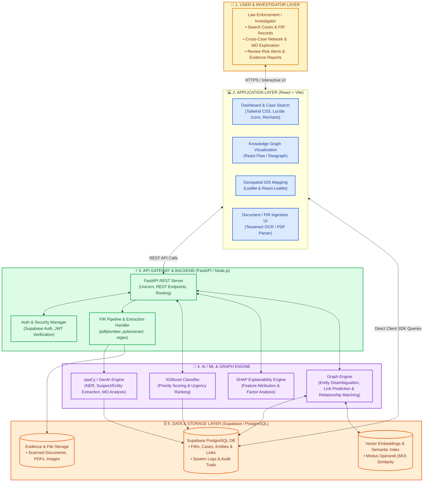

# 🏛️ NETRA / VAJRA-X21 System Architecture

This document provides a comprehensive technical overview and visual architecture diagram of the **NETRA (VAJRA-X21)** intelligence and investigative platform.

---

## 📊 End-to-End Architecture Diagram

---

## 🛠️ Layer Breakdown & Tech Stack

### 1. Frontend Layer
* **Framework**: React 19, Vite
* **Styling**: Tailwind CSS, PostCSS
* **Visualizations**: React Flow, Reagraph (Graph visualization), Leaflet / React-Leaflet (GIS Mapping), Recharts (Analytics & Charts)
* **Icons & Assets**: Lucide React

### 2. Backend & Gateway Layer
* **API Framework**: FastAPI (Python 3.10+) with Uvicorn ASGI server
* **Data Ingestion**: Node.js pipeline scripts (`run_pipeline.js`, `compute_ai_outputs.js`), `pdfplumber`, `pytesseract`
* **Authentication**: Supabase Auth (JWT-based role access)

### 3. AI / ML & Graph Intelligence Engine
* **Risk & Urgency Scoring**: XGBoost classifier + scikit-learn
* **Model Explainability**: SHAP (SHapley Additive exPlanations)
* **Natural Language Processing (NLP)**: spaCy, Google Gemini AI (GenAI), regex tokenizers for NER (names, phones, vehicles, addresses)
* **Link Prediction & Knowledge Graph**: Relational entity linking across multi-case FIRs

### 4. Database & Storage Layer
* **Primary Database**: Supabase PostgreSQL with relational schemas (`cases`, `entities`, `links`, `alerts`, `audit_logs`)
* **Vector & Text Search**: Semantic similarity embeddings for MO pattern matching
* **Storage**: Supabase Storage Buckets for FIR PDFs, scanned evidence, and media

---

## 🎯 Key Use Cases Supported

1. **Cross-Case Network Analysis**: Identifying recurring suspects, phone numbers, bank accounts, and vehicles across multiple FIRs.
2. **Modus Operandi (MO) Pattern Discovery**: Detecting patterns in criminal behavior, tools used, and target locations to link seemingly independent crimes.
3. **Anomaly & Risk Detection**: Highlighting unusual activity, severe offenses, and prioritizing cases requiring immediate investigative action.
4. **Investigator Intelligence**: Generating actionable leads, timeline reconstructions, and explainable AI insights for accelerated decision-making.
5. **Evidence Management**: Centralized, secure storage of digital evidence with traceability and audit logs.
