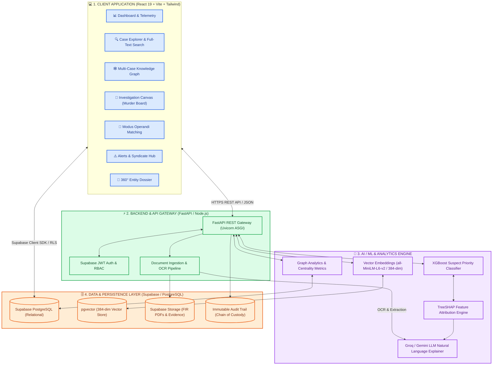
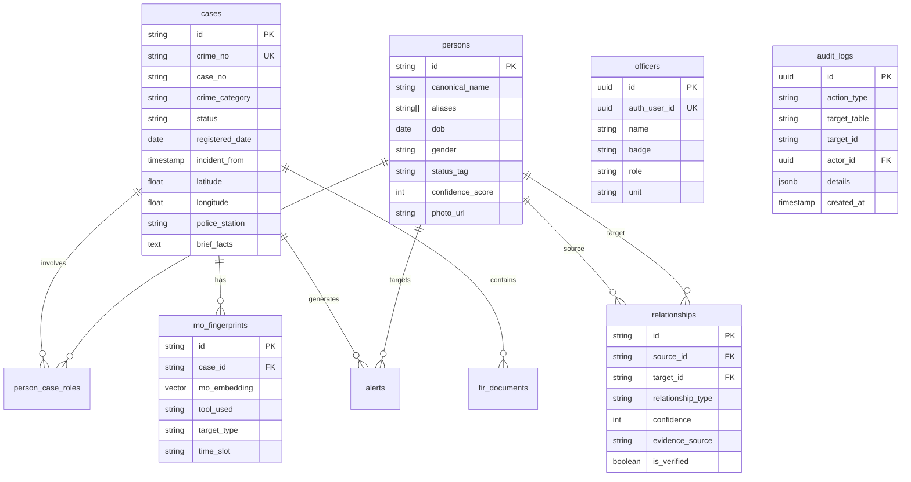
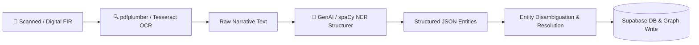

# 🏛️ NETRA (VAJRA-X21) — Complete Project Documentation & Presentation Guide
> **Smart India Hackathon (SIH) | Problem Statement: SIH 26189**  
> **System Name:** NETRA (National / Networked Evidence Tracking & Relational Analytics) / Code-name: **VAJRA-X21**  
> **Jurisdiction / Domain:** Criminal Intelligence Unit (CIU) & Law Enforcement Agency Automation

---

## 📑 Table of Contents
1. [Executive Summary & Problem Statement](#1-executive-summary--problem-statement)
2. [End-to-End System Architecture](#2-end-to-end-system-architecture)
3. [Complete Technology Stack](#3-complete-technology-stack)
4. [Core Features & UI Modules Deep Dive](#4-core-features--ui-modules-deep-dive)
5. [AI, Machine Learning & Mathematical Models](#5-ai-machine-learning--mathematical-models)
6. [Database Schema & Data Architecture](#6-database-schema--data-architecture)
7. [API & Microservice Specifications](#7-api--microservice-specifications)
8. [Data Ingestion & OCR/NLP Pipeline](#8-data-ingestion--ocrnlp-pipeline)
9. [Key Innovations & Competitive Advantages](#9-key-innovations--competitive-advantages)
10. [Presentation & Viva Cheatsheet (Q&A)](#10-presentation--viva-cheatsheet-qa)
11. [Setup, Installation & Deployment Guide](#11-setup-installation--deployment-guide)

---

## 1. Executive Summary & Problem Statement

### 1.1 The Challenge in Modern Policing
Police stations and investigative wings across India register thousands of **First Information Reports (FIRs)** daily. However, these reports exist in isolated data silos:
- **Fragmented Data**: Information regarding repeat suspects, burner phone numbers, getaway vehicles, and mule bank accounts is trapped inside unstructured narrative text in disparate station logs.
- **Manual Pattern Recognition**: Investigators have no automated way to detect that a house break-in in one district shares the exact same *Modus Operandi (MO)* and entry tool as a robbery three districts away.
- **Triage Overload**: Investigating Officers (IOs) lack an objective, data-backed priority ranking to determine which suspects or leads represent the highest immediate flight risk or threat severity.
- **Black-Box AI Skepticism**: Law enforcement cannot rely on opaque "black-box" neural networks in court without verifiable feature attribution and clear evidence lineage.

### 1.2 The NETRA Solution
**NETRA (VAJRA-X21)** is an institutional-grade **Criminal Intelligence Command Center & Multi-Case Relational Graph Platform**. It automates:
1. **Multi-Modal FIR Ingestion**: Converts scanned physical/PDF FIRs into structured relational entities (Suspects, Vehicles, Phones, Bank Accounts, Locations, Crime Heads) using OCR and LLMs.
2. **Interactive Multi-Case Knowledge Graph**: Visually traces cross-case syndicates, degree centrality hubs, bridge nodes, and hidden relationships across jurisdictions.
3. **Semantic Modus Operandi (MO) Similarity**: Uses high-dimensional sentence vector embeddings and weighted cosine matching to uncover serial offenders and linked cold cases.
4. **Explainable AI Suspect Priority Scoring (XGBoost + TreeSHAP)**: Ranks case urgency and suspect threat levels while providing mathematically proven SHAP factor attributions and plain-English judicial rationales.
5. **Interactive Investigation Canvas ("Digital Murder Board")**: Allows detectives to pin entities, draw timeline reconstructions, link digital evidence, and formulate hypotheses collaboratively.

---

## 2. End-to-End System Architecture



---

## 3. Complete Technology Stack

| Tier | Component | Technology / Library | Version | Description & Role |
| :--- | :--- | :--- | :--- | :--- |
| **Frontend** | Framework | **React.js** | `^19.0.0` | Declarative, component-driven UI for reactive state management |
| | Build Tool | **Vite** | `^6.0.0` | Ultra-fast HMR and optimized production asset bundling |
| | Styling | **Tailwind CSS** | `^4.0.0` | Utility-first, police dark-theme interface with responsive layouts |
| | Routing | **React Router DOM** | `^7.0.0` | Client-side routing across all 8 investigative modules |
| | Visualizations | **Recharts** | `^2.15.0` | Interactive charts for crime categories, priority curves & timelines |
| | Graph Engine | **Canvas / SVG & Reagraph** | Custom / D3 | Force-directed and tiered graph layout for multi-case networks |
| | GIS Mapping | **Leaflet & React-Leaflet** | `^1.9.0` | Geospatial mapping of FIR crime scenes and jurisdiction hotspots |
| | Iconography | **Lucide React** | `^0.470.0` | Modern, consistent vector icons |
| **Backend** | Microservice Framework | **FastAPI** | `^0.110.0` | Async Python ASGI framework for low-latency ML inference |
| | Server Engine | **Uvicorn** | `^0.28.0` | High-performance asynchronous HTTP server |
| | Schema Validation | **Pydantic (v2)** | `^2.6.0` | Strict input validation, data normalization and Swagger generation |
| | Scripting Runtime | **Node.js** | `v20+` | Batch data migrations, pipeline scripts, and CSV parsing |
| **AI / Machine Learning** | Classification Model | **XGBoost** | `^2.0.0` | Gradient-boosted tree model for suspect priority scoring (0–100) |
| | Model Preprocessing | **scikit-learn & NumPy**| `^1.4.0` | Feature scaling, matrix operations, and metric calculations |
| | Explainable AI | **TreeSHAP** | `^0.44.0` | Exact Shapley values calculation for feature attribution |
| | LLM Explanations | **Groq API / Google GenAI**| `llama-3.1` / `gemini-2.0` | Converts SHAP numeric values to human-readable legal explanations |
| | Semantic Embeddings| **SentenceTransformers** | `all-MiniLM-L6-v2` | 384-dimensional vector embeddings for Modus Operandi text |
| | Vector Fallback | **HashingVectorizer** | scikit-learn | Ultra-low-memory (120MB) embedding generation fallback |
| **Data & Storage** | Database | **Supabase PostgreSQL** | `15+` | Relational storage with Foreign Keys, Triggers, and RLS |
| | Vector Extension | **pgvector** | `^0.5.0` | High-speed vector indexing (HNSW/IVFFlat) for similarity search |
| | File Storage | **Supabase Storage** | S3 API | Secure bucket storage for FIR PDFs and evidence attachments |
| | Authentication | **Supabase Auth (JWT)** | OAuth / Password | Role-Based Access Control (Investigator, Analyst, Supervisor) |
| **Ingestion / OCR** | PDF Parsing | **pdfplumber / pdf-parse**| `^0.11.0` | Digital PDF layout extraction and text extraction |
| | OCR Engine | **pytesseract / Tesseract.js** | `v5.0` | Optical Character Recognition for scanned / physical documents |
| **DevOps & Cloud** | Frontend Hosting | **Vercel** | Edge CDN | Global edge delivery and continuous deployment from Git |
| | Backend Hosting | **Render** | Docker Container | Containerized Python microservice with automated health checks |

---

## 4. Core Features & UI Modules Deep Dive

### 4.1 📊 Dashboard & Operational Telemetry ([`src/pages/Dashboard.jsx`](file:///c:/Users/ASUS/Desktop/Netra%20ai/src/pages/Dashboard.jsx))
- **Live Key Metrics**: Displays real-time operational statistics:
  - *Active Open FIRs*
  - *High-Risk Suspects Identified*
  - *Multi-Case Syndicates Detected*
  - *Average Case Resolution Time*
- **Crime Distribution Analytics**: Recharts breakdowns by crime head (Theft, Robbery, Cyber Financial Fraud, Narcotics, Violent Crime) and police station jurisdictions.
- **Priority Triage Feed**: Instant stream of highest-priority suspects and cases calculated dynamically by the XGBoost scoring engine.

### 4.2 🕸️ Interactive Knowledge Graph ([`src/pages/KnowledgeGraph.jsx`](file:///c:/Users/ASUS/Desktop/Netra%20ai/src/pages/KnowledgeGraph.jsx))
- **Multi-Entity Relational Mapping**: Visualizes how disparate cases connect through 7 distinct entity types:
  - 👤 **Persons** (Accused, Key Suspect, Associate, Witness, Informant)
  - 📱 **Phones** (IMEI, CDR records, shared SIM cards)
  - 🚗 **Vehicles** (Registration numbers, chassis numbers, color/make)
  - 🏦 **Bank Accounts** (Mule accounts, transaction links)
  - 🏢 **Organizations** (Shell companies, front businesses)
  - 📍 **Locations** (Crime scenes, hideouts, drop points)
  - 📁 **Cases / FIRs** (Registered FIR records)
- **Advanced Graph Capabilities**:
  - **Bridge Node / Hub Detection**: Highlights entities linking 3+ distinct FIRs (e.g., a getaway motorcycle used in 4 different station jurisdictions).
  - **Degree Centrality Calculation**: Mathematically sizes nodes based on their graph connectivity.
  - **Shortest Path Finder**: Traces the exact criminal chain connecting any two selected suspects.
  - **Filter by Confidence & Date**: Investigators can filter out low-confidence inferred links to focus on verified evidence.

### 4.3 🧠 Modus Operandi (MO) Similarity Engine ([`src/pages/MOSimilarity.jsx`](file:///c:/Users/ASUS/Desktop/Netra%20ai/src/pages/MOSimilarity.jsx))
- **Semantic Vector Comparison**: Converts unstructured FIR crime descriptions into 384-dimensional dense vectors.
- **Weighted Multi-Factor Matching**: Compares crimes using:
  1. *Vector Semantic Similarity* (Embedding cosine distance)
  2. *Entry Method & Tool Used* (e.g., Gas cutter, lock-picking, spoofed SMS)
  3. *Target Profile* (e.g., Senior citizens, closed jewellery shops, ATMs)
  4. *Time-of-Day Pattern* (e.g., 02:00 AM – 04:30 AM window)
  5. *Geospatial Proximity* (Haversine distance between incident coordinates)
- **Uncovers Cold Cases**: Matches active open FIRs against unsolved historical cases to pinpoint serial offenders.

### 4.4 🔍 Case Search & Faceted Explorer ([`src/pages/CaseSearch.jsx`](file:///c:/Users/ASUS/Desktop/Netra%20ai/src/pages/CaseSearch.jsx))
- **Multi-Dimensional Filters**: Search by FIR Crime Number, IPC/BNS Sections (e.g., IPC 379, 392, 420), Police Station jurisdiction, Date Range, Status (`Open`, `Under Investigation`, `Chargesheet Filed`), and Risk Level.
- **Comprehensive Case Modal**: Displays complete incident facts, list of named suspects, linked vehicles/phones, and attached physical evidence logs.

### 4.5 📌 Investigation Canvas / Digital Murder Board ([`src/pages/CaseCanvas.jsx`](file:///c:/Users/ASUS/Desktop/Netra%20ai/src/pages/CaseCanvas.jsx))
- **Investigator Workspace**: Freeform canvas where detectives drag-and-drop evidence cards, suspects, and witness statements.
- **Timeline Reconstruction**: Sequences events chronologically to expose alibis and corroborate call data records (CDR).
- **Hypothesis & Notes Board**: Enables collaborative note-taking and lead logging for team briefings.

### 4.6 ⚠️ Intelligence Alerts & Syndicate Hub ([`src/pages/AlertsFindings.jsx`](file:///c:/Users/ASUS/Desktop/Netra%20ai/src/pages/AlertsFindings.jsx))
- **Automated Proactive Flags**:
  - *Repeat Offender Resurgence Alert*
  - *Cross-Jurisdiction Overlap Alert*
  - *Rapid Multi-Transaction Mule Account Alert*
  - *High Flight-Risk Indicator*
- **Actionable Lead Recommendations**: Provides officers with immediate next steps (e.g., *"Issue Look-Out Circular (LOC) for Vehicle MH-04-AB-1234"*).

### 4.7 👤 360° Entity Profile Dossier ([`src/pages/EntityProfile.jsx`](file:///c:/Users/ASUS/Desktop/Netra%20ai/src/pages/EntityProfile.jsx))
- Full dossier for any suspect, vehicle, phone, or bank account.
- Lists aliases, known associates, historical FIR involvements, graph centrality rank, and chronological timeline.

---

## 5. AI, Machine Learning & Mathematical Models

### 5.1 Suspect Priority Scoring Model (XGBoost)
The priority model outputs an institutional risk/urgency score **$S \in [0.0, 100.0]$** for every person of interest.

#### Input Feature Vector Schema (10 Standardized Features):
| Feature Name | Type | Range | Description & Mathematical Definition |
| :--- | :--- | :--- | :--- |
| `network_centrality` | `float` | $[0.0, 1.0]$ | Normalized degree/betweenness centrality in the multi-case graph |
| `direct_connection_count` | `int` | $[0, \infty)$ | 1-hop degree (number of directly connected entities) |
| `observed_vs_inferred_ratio` | `float` | $[0.0, 1.0]$ | Ratio of hard evidence edges to total edges $\frac{E_{\text{observed}}}{E_{\text{total}}}$ |
| `avg_relationship_confidence`| `float` | $[0.0, 100.0]$ | Mean confidence percentage across all incident links |
| `role_weight` | `float` | $[0.0, 1.0]$ | Categorical severity: Accused (1.0), Key Suspect (0.85), Associate (0.6), etc. |
| `prior_case_count` | `int` | $[0, \infty)$ | Number of historically registered FIR involvements |
| `mo_case_match_flag` | `int` | $\{0, 1\}$ | Binary flag: $1$ if MO matches an active serial cluster |
| `evidence_count` | `float` | $[0.0, \infty)$ | Total verified physical/digital evidence items linked |
| `alert_count` | `int` | $[0, \infty)$ | Number of active anomaly or link-prediction alerts |
| `avg_alert_confidence` | `float` | $[0.0, 100.0]$ | Mean confidence score across active intelligence alerts |

#### Fallback Heuristic Formulation (Fail-Safe Mechanism):
When running in disconnected/offline environments, NETRA uses a calibrated fallback formula:
$$S = \text{clamp}\Big( w_{\text{role}} \cdot 25 + C_{\text{net}} \cdot 20 + \min(N_{\text{priors}} \times 4, 20) + F_{\text{MO}} \cdot 15 + \min(N_{\text{conn}} \times 1.5, 10) + \min(N_{\text{evid}} \times 1.2, 10), 0, 100 \Big)$$

---

### 5.2 Explainable AI (XAI) with TreeSHAP
To ensure transparency in judicial proceedings, NETRA calculates exact **Shapley Additive Explanations (TreeSHAP)**:
$$f(x) = \phi_0 + \sum_{i=1}^{M} \phi_i(x)$$
Where:
- $f(x)$ is the predicted priority score.
- $\phi_0$ is the base expected value across the training distribution.
- $\phi_i(x)$ is the exact marginal contribution of feature $i$ in points ($+$ or $-$).

#### Natural Language Reasoning Generation (LLM Explainer):
The numeric SHAP values are passed to a strictly constrained LLM prompt (Groq / Gemini) to generate 1–2 judicial-grade sentences without hallucinations or legal prejudgment:
> *"Subject warrants prioritized review (+24.5 pts) due to high network bridge centrality across 4 FIRs and strong modus operandi alignment (+10.0 pts) with active serial robbery patterns."*

---

### 5.3 Modus Operandi Semantic Embedding & Similarity Math
1. **Dense Text Embedding**: The textual narrative of the crime is embedded using Sentence-BERT into a normalized 384-dimensional vector $\vec{u}$:
   $$\vec{u} = \frac{\text{Embed}(\text{Text})}{\|\text{Embed}(\text{Text})\|_2}$$
2. **Cosine Similarity**:
   $$\text{Sim}_{\text{text}}(\vec{u}_A, \vec{u}_B) = \frac{\vec{u}_A \cdot \vec{u}_B}{\|\vec{u}_A\| \|\vec{u}_B\|}$$
3. **Composite MO Match Score**:
   $$\text{Score}_{\text{MO}} = \alpha \cdot \text{Sim}_{\text{text}} + \beta \cdot \mathbb{I}(\text{Tool}_A = \text{Tool}_B) + \gamma \cdot \mathbb{I}(\text{Target}_A = \text{Target}_B) + \delta \cdot \text{Sim}_{\text{geo}}(A, B)$$
   *(where $\alpha=0.45, \beta=0.20, \gamma=0.20, \delta=0.15$)*

---

## 6. Database Schema & Data Architecture

The PostgreSQL database on Supabase follows strict relational normal form with `pgvector` indexing.



### Table Categories & Access Controls:
1. **Source Data Tables**: `cases`, `persons`, `phones`, `vehicles`, `accounts`, `organizations`, `locations`, `events`, `person_case_roles`, `fir_documents`.
2. **Intelligence Tables**: `relationships`, `mo_fingerprints`, `mo_similarities`, `evidence`, `evidence_links`.
3. **Model Output Tables**: `entityresolutionoutput`, `networkcommunity`, `linkpredictionoutput`, `anomalydetectionoutput`, `alerts`.
4. **Security & Governance**: `officers` (RBAC), `audit_logs` (Immutable chain of custody).

---

## 7. API & Microservice Specifications

The Python FastAPI microservice runs on `priority-model-service/main.py`.

### 7.1 Key Endpoints:

#### `POST /predict/suspect-priority`
Calculates priority score for a suspect feature vector.
```json
// Request Payload
{
  "network_centrality": 0.78,
  "direct_connection_count": 8,
  "observed_vs_inferred_ratio": 0.85,
  "avg_relationship_confidence": 92.0,
  "role_weight": 1.0,
  "prior_case_count": 4,
  "mo_case_match_flag": 1,
  "evidence_count": 6.0,
  "alert_count": 3,
  "avg_alert_confidence": 88.5
}

// Response (200 OK)
{
  "priority_score": 88.4,
  "model_name": "XGBoost-SuspectPriority",
  "model_version": "1.0.0",
  "feature_version": "10-features-v1",
  "generated_at": "2026-09-05T01:20:00Z",
  "model_mode": "production"
}
```

#### `POST /explain/suspect-priority`
Computes TreeSHAP factor attributions and returns AI plain-English reasoning.
```json
// Response (200 OK)
{
  "priority_score": 88.4,
  "reasoning": "Top contributing factors: network bridge centrality, prior case involvements, modus operandi serial match. Presents elevated investigative relevance based on multi-case graph patterns.",
  "reasoning_source": "llm",
  "top_contributions": [
    { "feature": "network_centrality", "label": "network bridge centrality", "shap_value": 24.2, "impact": "positive" },
    { "feature": "prior_case_count", "label": "prior case involvements", "shap_value": 14.8, "impact": "positive" },
    { "feature": "mo_case_match_flag", "label": "modus operandi serial match", "shap_value": 9.5, "impact": "positive" }
  ],
  "generated_at": "2026-09-05T01:20:00Z"
}
```

#### `POST /api/mo/embed`
Computes 384-dimensional dense vector embeddings for input crime narratives.

#### `POST /api/ingestion/upload-fir`
Multi-part endpoint accepting scanned PDF/images, running OCR, entity extraction, and auto-populating database tables.

---

## 8. Data Ingestion & OCR/NLP Pipeline



1. **Document Intake**: Officer uploads scanned physical FIR or digital PDF.
2. **Text Normalization**: `pdfplumber` extracts raw digital text; `pytesseract` handles scanned raster images.
3. **Structured Entity Extraction**: Google Gemini / spaCy parses the text against strict Pydantic schemas to extract:
   - Accused & Suspect Names, Aliases
   - Phone Numbers & IMEI references
   - Vehicle Registration Plates
   - Stolen Property / Cash Values
   - Relevant Acts/Sections (e.g. IPC 379, 392, 420)
4. **Entity Resolution**: Checks database for matching phone numbers, aliases, or vehicle numbers to merge profiles or create new graph links.

---

## 9. Key Innovations & Competitive Advantages

1. **Explainable AI vs Black-Box Neural Nets**: Rather than providing an opaque risk score, NETRA provides **mathematically exact TreeSHAP attributions**, giving investigators courtroom-admissible clarity on *why* an entity is flagged.
2. **Multi-Case Knowledge Graph**: Solves the single-station silo problem by identifying suspects and assets operating across jurisdictional boundaries.
3. **Multi-Factor MO Similarity with Vector Search**: Combines semantic embeddings (`pgvector`) with domain heuristics (tools, time, targets) to catch serial criminal patterns.
4. **Digital Murder Board (Investigation Canvas)**: Provides a dedicated, tactile investigative environment replacing traditional whiteboard setups with real-time digital provenance.
5. **Fail-Safe Offline Architecture**: Operates with dynamic fallback heuristics and client caching if cloud connectivity is interrupted in field operations.

---

## 10. Presentation & Viva Cheatsheet (Q&A)

### Q1: Why did you choose XGBoost over a Deep Neural Network (DNN) for priority scoring?
> **Answer**: Tabular criminal intelligence features (centrality indices, connection counts, prior cases) are structured data where Gradient-Boosted Decision Trees (XGBoost) consistently outperform DNNs in accuracy and inference speed. Crucially, XGBoost supports **TreeSHAP**, allowing exact, polynomial-time Shapley feature attribution, which is essential for transparency and legal accountability in law enforcement.

### Q2: How does the system prevent AI hallucinations when extracting FIR data?
> **Answer**: We enforce **strict Pydantic schema validation** at the API gateway and use structured JSON output mode in our LLM pipeline. The extracted entities are mapped directly to immutable character spans in the source FIR text. Furthermore, the system flags any inferred relationships as unverified until an officer reviews the evidence link.

### Q3: How do you handle FIRs written in regional Indian languages (e.g., Marathi, Hindi)?
> **Answer**: Tesseract OCR is configured with multi-lingual trained data (`hin.traineddata`, `mar.traineddata`, `eng.traineddata`). The extracted vernacular text is processed via Google Gemini's multilingual LLM pipeline, which translates and normalizes fields into standardized English schemas while preserving the original vernacular transcript.

### Q4: How is entity resolution (deduplication) handled across different FIRs?
> **Answer**: We use deterministic identifiers (Phone numbers, Vehicle Registration, Bank Account Hashes, Aadhaar) as primary hard-matching keys, and phonetic/string-distance algorithms (Jaro-Winkler, Levenshtein) combined with alias lists for suspect names. When confidence exceeds 85%, profiles are linked in the Knowledge Graph with a confidence tag.

### Q5: What security and data privacy measures are implemented?
> **Answer**: NETRA implements **Supabase Row Level Security (RLS)** keyed to officer badge roles (Investigator, Analyst, Supervisor, Admin). Every action (case view, node edit, export) writes an immutable record to the `audit_logs` table, maintaining an unbroken chain of custody.

---

## 11. Setup, Installation & Deployment Guide

### 11.1 Prerequisites
- **Node.js**: `v20.x` or higher
- **Python**: `3.10` or `3.11`
- **Supabase Account** with PostgreSQL database and `pgvector` enabled
- **Git**

### 11.2 Frontend Setup
```bash
# Clone the repository
git clone https://github.com/badgujarkunal93-blip/NETRA.git
cd "Netra ai"

# Install dependencies
npm install

# Configure environment variables (.env)
cp .env.example .env
# Fill in VITE_SUPABASE_URL, VITE_SUPABASE_ANON_KEY, VITE_PRIORITY_MODEL_URL

# Start development server
npm run dev
# App will launch on http://localhost:5173
```

### 11.3 Python ML Microservice Setup
```bash
cd priority-model-service

# Create virtual environment
python -m venv venv
# Windows:
.\venv\Scripts\activate
# Linux/Mac:
source venv/bin/activate

# Install dependencies
pip install -r requirements.txt

# Run FastAPI server
uvicorn main:app --reload --port 8000
# API docs available at http://localhost:8000/docs
```

### 11.4 Database Setup
1. Open your Supabase project SQL Editor.
2. Execute the entire script in [`supabase_schema.sql`](file:///c:/Users/ASUS/Desktop/Netra%20ai/supabase_schema.sql).
3. Confirm table creations and RLS policies.

---

*NETRA (VAJRA-X21) — Empowering Law Enforcement with Explainable AI & Relational Intelligence.*
